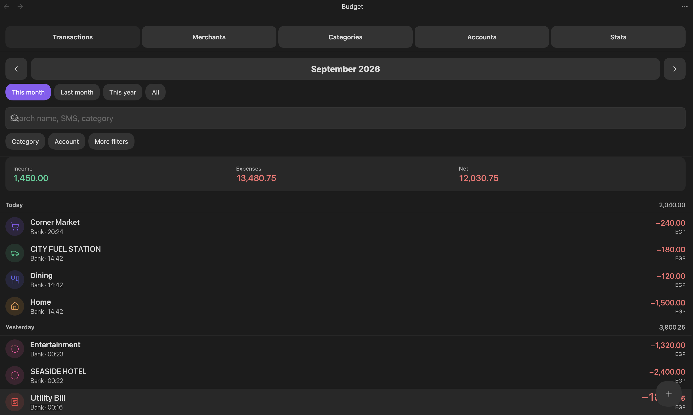
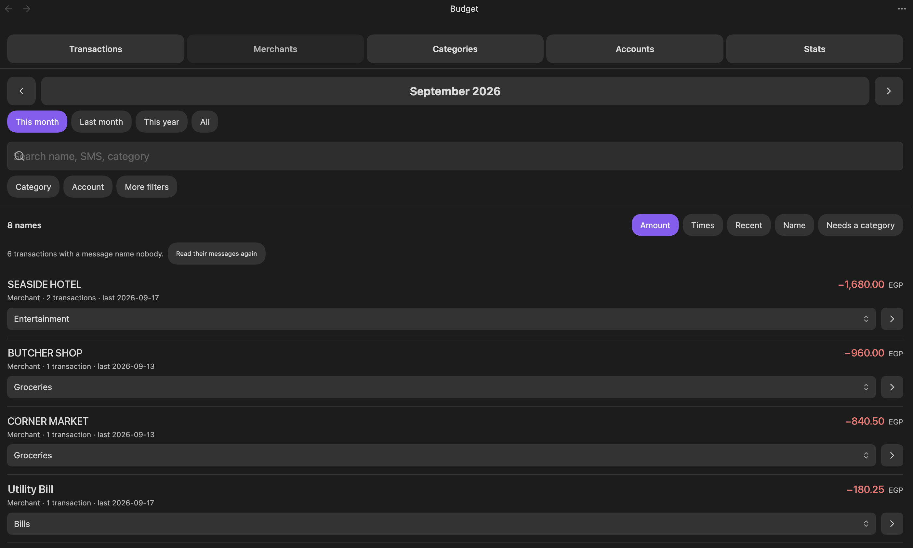
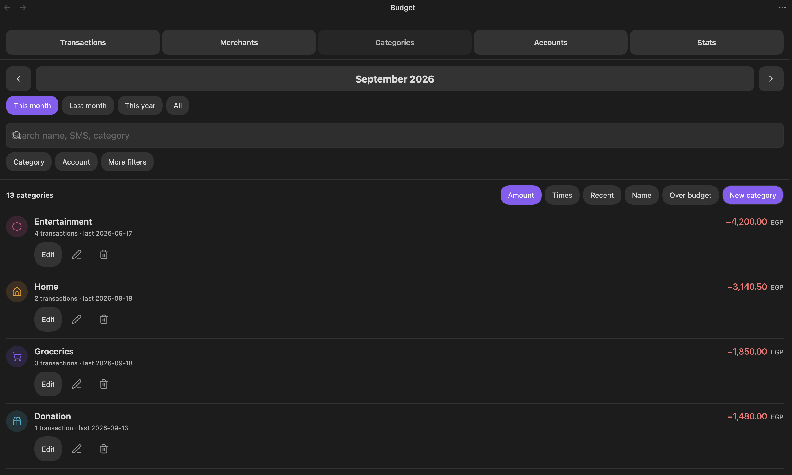
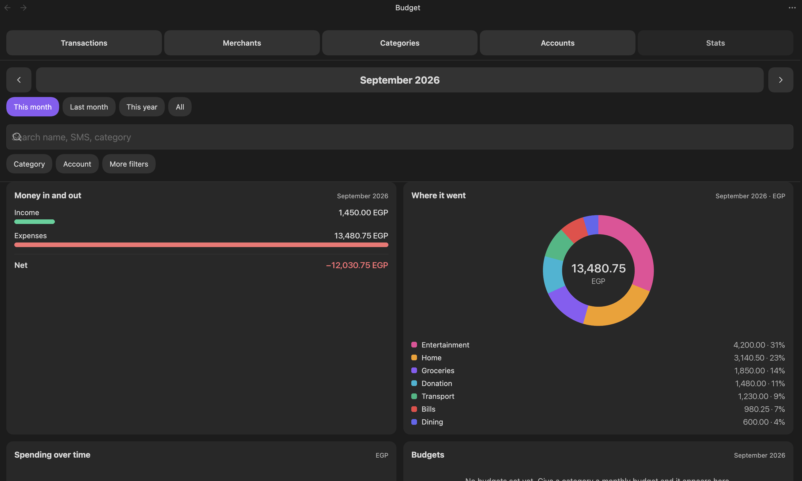

# Ultra Budget Tracker

Turn bank SMS messages into structured transaction notes, then read your spending,
budgets and account balances in a budget view built into Obsidian. Everything is parsed
locally — nothing leaves the vault.

Your data stays plain Markdown and JSON in a `Budget/` folder, so it is greppable,
diffable, syncable, and yours after the plugin is gone.

---

## Contents

- [What it does](#what-it-does)
- [Screenshots](#screenshots)
- [Install](#install)
- [Quick start](#quick-start) — creating the files it needs
- [Usage](#usage) — the Budget view, commands, embeds
- [Configuration](#configuration) — from the UI, from Markdown, or from JSON
- [iPhone Shortcuts](#iphone-shortcuts)
- [Privacy](#privacy)
- [Support](#support)
- [Development](#development)

---

## What it does

- **Captures** a bank SMS from an iPhone automation as a file dropped in `Budget/Inbox`,
  and derives every field from the message text.
- **Filters** out what is not a transaction. A statement reminder, a due date, a one-time
  code or an offer carries an amount and a card number too; only a message that says money
  actually moved becomes a note.
- **Parses** English and Arabic wordings out of the box, with Arabic spellings folded
  together (`إلى` / `الى` / `الي` are one phrase). Your own patterns always win over the
  built-ins.
- **Names the other side** of every transaction under the key that says what it was:
  `merchant` for a purchase, `recipient` for money sent, `sender` for money received.
- **Files it** into a category, learning from the names you categorise by hand.
- **Shows it** in a five-tab Budget view: transactions, merchants, categories, accounts
  and stats — with balances, budgets and charts.
- **Excludes** reversals and duplicate messages, by hand or by rule. A manual decision
  always beats a rule.

Works identically on desktop and mobile. No Python, no desktop-only APIs, no network
requests, no telemetry.

---

## Screenshots

*Sample data — the figures and names below are invented.*

**Transactions**, grouped by day, with the month's income, expenses and net across the top.



**Merchants**, every name the messages produced, largest first. Choosing a category here files
every transaction of that name and teaches the keyword rules to file the next one on its own.



**Categories**, the same money read by category, with what each one spent and its budget.



**Stats**, where the money went over the period.



---

## Install

### From Community plugins

1. **Settings → Community plugins → Browse**.
2. Search for **Ultra Budget Tracker**.
3. **Install**, then **Enable**.
4. Restart Obsidian once, so the `obsidian://` capture link registers.

### Manually

Download `main.js`, `manifest.json` and `styles.css` from the
[latest release](https://github.com/a7med7asan15/obsidian-finance-automation/releases/latest)
and put all three in:

```text
<vault>/.obsidian/plugins/ultra-budget-tracker/
```

Then restart Obsidian and enable **Ultra Budget Tracker** under Community plugins.

---

## Quick start

### The short version

Enable the plugin, open the Budget view (wallet icon in the ribbon), and use the buttons:
**New account** on the Accounts tab, **New category** on the Categories tab. That writes
every file described below for you. Everything under [Configuration](#configuration) is
the same data, for when you would rather type it.

### The files it needs

Only two things are required before the plugin is useful: **the folders** and **one
account**. The rest is optional and can be added whenever you want it.

```text
<vault>/
└── Budget/
    ├── Inbox/                      ← iPhone drops bank messages here      (required for capture)
    ├── Transactions/               ← one note per transaction             (written for you)
    ├── Accounts/                   ← one note per account                 (required: at least one)
    │   └── CIB.md
    └── Settings/
        ├── config.json             ← default currency                    (optional)
        ├── sms_patterns.json       ← parser patterns and keywords         (optional)
        ├── accounts.json           ← accounts without a note              (optional)
        ├── exclusion_rules.json    ← auto-exclude rules                   (optional)
        └── Categories/
            ├── rules.json          ← keyword → category                   (written for you)
            └── Groceries.md        ← one note per category                (optional)
```

Create `Budget/Inbox` by hand once — from Obsidian, or from the Files app on iOS — before
the first capture. `Budget/Transactions` and the category rules are written for you on
first use.

### One account, minimally

An account is a note in `Budget/Accounts/`. **The file name is the account name.** The
only key that really matters is `card_endings`: list every digit group your bank uses for
that account — debit card, credit card, and the account number can all belong to one note —
and every message carrying one of those numbers files itself here.

`Budget/Accounts/CIB.md`:

```yaml
---
type: account
name: "CIB"
currency: EGP
account_type: bank
institution: "Commercial International Bank"
card_endings:
  - "0779"
  - "1934"
aliases:
  - "cib"
opening_balance: 12500
opening_date: "2026-01-01"
balance:
active: true
include_in_net_worth: true
---
```

`opening_balance` is what the account held on `opening_date`; the Budget view adds every
transaction since to derive the current balance. `balance` is an optional statement figure
the derived balance is measured against, so drift is visible.

That is enough. Send a bank message through the inbox and it becomes a transaction.

---

## Usage

### The Budget view

Open it from the wallet icon in the ribbon, or **Open budget** in the command palette.
Five tabs share one set of filters.

| Tab | What it gives you |
|---|---|
| **Transactions** | Grouped by day, current month by default. Step months with the arrows, or tap the month name for a year, all time, or a custom range. Tap a row to edit it; long-press (iPhone) or right-click (desktop) for quick category and exclude actions. **+** adds one by hand. |
| **Merchants** | Every merchant, recipient and sender, one row each, largest first. Choosing a category files every transaction of that name **and** teaches `rules.json`, so the next message files itself. Sort by amount, count, recency or name; narrow to what is still Uncategorized. |
| **Categories** | The same money read by category: spend against budget, per row. **Edit** opens colour, icon, monthly budget and keywords in place. Renaming re-files every transaction and moves the keywords along. Deleting asks where its transactions should go. |
| **Accounts** | A card per account with its derived balance, what the period moved through it, and how far the statement figure has drifted. The pencil opens every key the note holds. Renaming moves the note **and** re-files every transaction that named it. |
| **Stats** | Charts and totals for the filtered period, plus a CSV export. |

An account or category that your transactions name but no note describes is listed anyway,
with a **Set up** button that writes the note.

### Excluding a transaction

Excluding keeps a transaction in the list but removes it from every total — use it for a
reversal, a duplicate SMS, or anything that did not really happen. **Edit exclusion rules**
does it automatically for matching transactions; anything you excluded by hand is never
overridden by a rule.

### Commands

| Command | Does |
|---|---|
| **Open budget** | Opens the Budget view |
| **Process pending SMS transactions** | Parses everything still `status: pending` |
| **Import messages from the SMS inbox** | Pulls `Budget/Inbox` in right now |
| **Add transaction** | Adds one by hand |
| **List merchants, recipients and senders** | Opens the Merchants tab |
| **Edit categories and budgets** | Opens the Categories tab |
| **Edit exclusion rules** | Opens the rules editor |
| **Apply exclusion rules to all transactions** | Re-runs every rule over everything |
| **Fill in missing merchants from stored messages** | Re-reads stored messages and fills only the blanks |
| **Export filtered transactions as CSV** | Writes the current filter to a CSV in the vault |

### Embedding a summary in a note

````markdown
```finance-summary
period: 2026-09
categories: Groceries, Transport
accounts: CIB
limit: 8
```
````

`period` takes `YYYY-MM`, `YYYY`, or `all`, and defaults to the current month. The other
three are optional; `categories` and `accounts` are comma-separated.

---

## Configuration

**Three routes to the same data. Use whichever you like — they are interchangeable.**

| | Route | Best for |
|---|---|---|
| 1 | **The Budget view** — buttons and editors | Everything. It writes the Markdown and the JSON for you. |
| 2 | **Markdown notes** in `Budget/Accounts/` and `Budget/Settings/Categories/` | Accounts and categories, in frontmatter you can read at a glance |
| 3 | **JSON files** in `Budget/Settings/` | Parser patterns, bulk edits, and anything you want to version or paste |

Nothing is JSON-only except the parser patterns, and nothing is UI-only at all. Edit a
file by hand and the view picks it up; change it in the view and the file is rewritten in
the same shape.

### Accounts — Markdown *or* JSON

The note in `Budget/Accounts/` is the source of truth. `Budget/Settings/accounts.json`
holds the same shape for an account that has no note yet, and the two are **merged by
name** — a card ending listed in either one resolves to the account.

<table>
<tr><th><code>Budget/Accounts/CIB Visa.md</code></th><th><code>Budget/Settings/accounts.json</code></th></tr>
<tr><td>

```yaml
---
type: account
name: "CIB Visa"
currency: EGP
card_endings: ["1234"]
aliases: ["cib"]
opening_balance: 0
opening_date: "2026-01-01"
active: true
include_in_net_worth: true
---
```

</td><td>

```json
{
  "accounts": [
    {
      "name": "CIB Visa",
      "currency": "EGP",
      "card_endings": ["1234"],
      "aliases": ["cib"]
    }
  ]
}
```

</td></tr>
</table>

An account also matches when its name or one of its `aliases` appears in the message. When
nothing matches, the transaction is filed under `Card ••••1234` so the number is never
lost — and it re-files itself the moment an account claims that ending.

### Categories — Markdown *or* JSON

A category note carries how it *looks and budgets*; `rules.json` carries how a message
*finds* it. You need neither to start: an uncategorised transaction is still a
transaction, and the Merchants tab writes both files as you categorise.

`Budget/Settings/Categories/Groceries.md`:

```yaml
---
type: category
name: "Groceries"
currency: EGP
monthly_budget: 4000
color: "#4caf50"
icon: shopping-cart
---
```

`Budget/Settings/Categories/rules.json` — first matching keyword wins, case-insensitive,
matched as a substring of the message:

```json
{
  "rules": [
    { "category": "Groceries", "keywords": ["carrefour", "seoudi", "gourmet"] },
    { "category": "Transport", "keywords": ["uber", "careem", "bolt"] }
  ]
}
```

### Default currency

`Budget/Settings/config.json`, used when a message names an amount but no currency:

```json
{ "default_currency": "EGP" }
```

### Parser patterns

`Budget/Settings/sms_patterns.json` is the one JSON-only file. Every key is optional, every
value is a list, and **a built-in list is appended to whatever you write** — so an entry
here widens what is understood rather than replacing it, and your pattern is always tried
first.

| Key | Decides |
|---|---|
| `transaction_keywords` | whether the message is parsed at all — it must say money moved |
| `amount_patterns` | `amount` and `currency` |
| `card_ending_patterns` | the digits looked up in `card_endings` |
| `debit_keywords`, `credit_keywords`, `transfer_keywords`, `fee_keywords` | `transaction_type`, and which side of a transfer your account is on |
| `merchant_patterns`, `recipient_patterns`, `sender_patterns` | the name of the other side |
| `date_patterns` | `timestamp`, when the message carries a date |

Patterns use Python-flavoured regular expressions: `(?i)` for case-insensitivity, and a
named group `(?P<name>…)` for the capture (the first unnamed group is used as a fallback).

```json
{
  "transaction_keywords": ["تم سداد"],
  "merchant_patterns": [
    "(?i)(?:at|merchant)\\s+(?P<name>[A-Za-z0-9][A-Za-z0-9 .&'/_-]{1,60}?)(?=\\s+(?:on|using|balance)\\b|[.;,]|$)"
  ],
  "recipient_patterns": [
    "(?i)(?:إلى|الى|لحساب)\\s+(?P<name>[^.;,\\n]{2,60}?)(?=\\s+(?:في|الرصيد)|[.;,]|$)"
  ]
}
```

Built in already, so most banks need nothing here: `at` / `عند` / `لدى` for a merchant,
`to` / `إلى` / `لحساب` for a recipient, `from` / `من` for a sender, and `تم خصم`,
`من حسابك`, `إلى حسابك`, `تم تنفيذ تحويل`, `charged`, `debited`, `credited`, `transferred`
for the direction of the money. Add to this file only when your bank says something the
built-ins miss.

### Exclusion rules

`Budget/Settings/exclusion_rules.json`, or the editor under **Edit exclusion rules**:

```json
{
  "rules": [
    {
      "id": "refunds",
      "name": "Reversals",
      "enabled": true,
      "reason": "Reversed by the bank",
      "match": "all",
      "conditions": [
        { "field": "sms_message", "op": "contains", "value": "استرداد" }
      ]
    }
  ]
}
```

- `field` — `sms_message`, `merchant`, `from_account`, `to_account`, `category`,
  `transaction_type`, `amount`, `timestamp`. (`merchant` matches a recipient and a sender too.)
- `op` — `contains`, `not_contains`, `equals`, `not_equals`, `starts_with`, `ends_with`,
  `matches`, `gt`, `lt`, `between` (which also takes `value2`).
- `match` — `all` or `any`.

### Plugin settings

**Settings → Community plugins → Ultra Budget Tracker**: process on startup, watch
transaction notes, apply exclusion rules automatically, and a shortcut to the rules editor.

---

## iPhone Shortcuts

Two ways in, and they do not overlap.

| Way | Travels as | You supply |
|---|---|---|
| **Inbox** — automatic, for bank messages | a file in `Budget/Inbox` | nothing but the message |
| **Manual** — you tap it, for cash and anything with no SMS | `obsidian://finance-transaction` | the fields, via prompts |

Every bank message goes through the inbox. A file has no length ceiling and it survives the
app being closed, which a link does not: iOS drops a link outright when the link is what
launches Obsidian, and a long encoded message stops arriving at all. Enable the plugin and
restart Obsidian once before using the manual link, so the handler registers.

### 1. The inbox, for bank messages — four actions

1. **Shortcuts → Automation → +** → **Message**.
2. Tap **Sender**, pick your bank's sender name or number, then **Run Immediately → Next →
   New Blank Automation**. Nothing about the sender is sent to Obsidian; it is only the trigger.
3. Add **Text**, and insert the **Shortcut Input** variable as its entire content. No URL
   encoding, no brackets, nothing else.
4. Add **Save File**:
   - **Service**: On My iPhone
   - **Destination**: `Obsidian/⟨your vault⟩/Budget/Inbox`
   - **Ask Where to Save**: **off**
   - **Overwrite If File Exists**: **off**, so two messages in the same minute both survive
5. **Done**.

Obsidian reads the inbox at startup — even with *Process when Obsidian starts* turned off,
because capturing is not processing — and on every pass. Each `.txt`, `.md`, `.text` or
`.log` file becomes one transaction. The file is deleted only after its note is on disk, so
a capture is never consumed without a note to show for it. A message that is not about money
moving is discarded and counted in the notice; forward the whole bank thread if that is
easier, and only the transactions will land.

### 2. Manual, for cash and anything with no SMS

```text
obsidian://finance-transaction?amount=120.50&currency=EGP&account=Cash&type=debit
```

Build it as a normal Shortcut, not an automation: **Ask for Input** for the amount, **Choose
from Menu** for the account and the type, then a **Text** action holding the link with those
variables dropped into it, and **Open URLs** with that text as its input. Add it to the Home
Screen and it is one tap.

Parameters: `amount`, `currency`, `account`, `type` (`debit`, `credit`, `transfer`, `fee`),
and optionally `merchant` (or `recipient` / `sender`), `category`, `date`, and `from` / `to`
in place of `account` for a transfer.

**The full walkthrough, with every screen and every failure mode, is in
[docs/iphone-shortcuts.md](docs/iphone-shortcuts.md).**

### What gets read out of a message

| Field | Comes from |
|---|---|
| `amount`, `currency` | `amount_patterns`, falling back to `default_currency` |
| `from_account` / `to_account` | `card_ending_patterns` → `card_endings` on the account notes |
| `transaction_type` | the debit / credit / transfer / fee keyword lists |
| `merchant`, `recipient` or `sender` | the party patterns the type calls for |
| `category` | the keyword rules in `Categories/rules.json` |
| `timestamp` | the date in the message, else the moment it was captured |

A note becomes `status: parsed` once it has an amount, a currency, a type and an account.
Anything less stays `status: pending` — never dropped — and is retried on every pass, so
adding a missing card ending or pattern is enough to finish it. A note that already reached
`parsed` is never re-parsed, so for transactions filed before the parser knew a wording, run
**Fill in missing merchants from stored messages**; it only ever fills a blank.

---

## Privacy

Every message is parsed on the device, by this plugin, inside your vault. No SMS text, no
transaction, and no setting is sent anywhere. The plugin makes no network requests at all
and collects no telemetry.

---

## Support

If this saves you time, you can say thanks:

<a href="https://buymeacoffee.com/a7med7asan15"></a>

**[buymeacoffee.com/a7med7asan15](https://buymeacoffee.com/a7med7asan15)**

Bugs and feature requests:
[GitHub issues](https://github.com/a7med7asan15/obsidian-finance-automation/issues).

---

## Development

TypeScript under `src/`, bundled to a single `main.js` by esbuild. **`main.js` is a build
artifact — edit the sources, never the bundle.**

**Clone outside your vault.** `node_modules` alone is around a thousand files and 43 MB;
inside a vault, Obsidian indexes all of it at every launch and a sync plugin tries to push
it, which on a phone means a long hang on a black screen at startup.

```bash
git clone https://github.com/a7med7asan15/obsidian-finance-automation.git ~/dev/ultra-budget-tracker
cd ~/dev/ultra-budget-tracker
npm install
npm run dev       # rebuild on change, and copy into the vault
npm test          # unit tests for every calculation
npm run build     # typecheck, then a one-shot production bundle
```

To have the build install itself, point it at your vault — either
`export OBSIDIAN_VAULT=/path/to/vault`, or one line in a gitignored `.vaultpath` file at the
repo root. Without it the bundle is still built, just not copied, and a path that is not a
vault is skipped rather than written to. Reload Obsidian after a build.

### Cutting a release

```bash
scripts/release.sh patch "fixes a stale balance after a rename"
scripts/release.sh minor "adds the stats tab"
scripts/release.sh 1.1.0 --dry-run    # run the checks, print the plan, change nothing
```

It bumps `manifest.json`, `package.json` and `versions.json`, commits, tags and pushes; the
tag starts [`.github/workflows/release.yml`](.github/workflows/release.yml), which builds
and publishes the release with `main.js`, `manifest.json` and `styles.css` as individual
assets. The tag, the release name and the manifest version always match — Obsidian requires it.

Before writing anything the script requires main, a clean tree, a branch not behind origin,
a newer version, an unused tag, and a green `npm test` and `npm run build`.

---

## License

[MIT](LICENSE)
